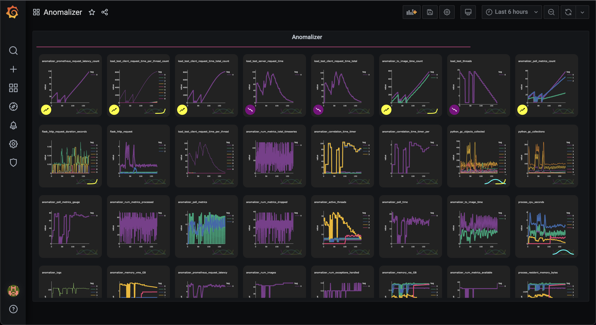

# Anomalizer Grafana Plugin by Pogadog

    

This is the Grafana plugin for the Anomalizer, which provides Prometheus anomaly visualization. Written in React Typescript with the Grafana plugin infastructure, it's based upon the [original React-Native UI](https://github.com/pogadog/anomalizer-ui).

> With its grid-based design and similar metrics feature, the Anomalizer UI aims to create the perfect balance of computer intelligence and the human eye to help find anomalies within your system.

> With split-pane views, actionable features, and quick filter mechanisms, the Anomalizer UI helps you find metrics that are important, faster.

> The Anomalizer UI follows the Airbus [*dark cockpit*](https://www.icao.int/ESAF/Documents/meetings/2017/AFI%20FOSAS%202017/Day%201%20Docs/Day_1_2_Airbuspihlo.pdf) aircraft design philosophy with its presentation of metrics by visually highlighting metrics you need to know about on its main page, allowing you to identify anomalies in your system within a fraction of a second.

This plugin is in active development. It's constantly being improved upon, gradually implementing features from the original UI.

# Co-dependents

This project is not standalone; it requires the Anomalizer server, which can be boostrapped through its Github project [here](https://github.com/pogadog/anomalizer), or accessed in a production environment [here](https://anomalizer.app) on the web.

This plugin connects to the instance via url eg. `https://engine.anomalizer.app`, `http://localhost:8056`.

# Getting Started (Alpha Release)

>The following instructions are for the Alpha release of the Anomalizer Grafana Plugin. The steps for getting started will be *much* easier when it's published to the Grafana Marketplace soon.

### Requirements
- Docker

### Start Grafana
- Download the latest release of the Anomalizer Grafana Plugin. You should now have a zip file called `pogadog-anomalizer-panel-0.0.x.zip` in your `Downloads` folder from here: https://github.com/Pogadog/anomalizer-grafana-plugin/releases
- Extract the zip folder. There should now be a folder called `pogadog-anomalizer-panel` in your `Downloads` folder
- *[MacOS and Linux]* Open up a terminal, and `cd` into your `Downloads` folder. Run the following command inside your `Downloads` folder: 
    - `docker run -d -p 3000:3000 -v "$(pwd)"/pogadog-anomalizer-panel:/var/lib/grafana/plugins --name=grafana-anomalizer grafana/grafana:7.0.0`

### Build the Panel
- Open up your Grafana Dashboards on [http://localhost:3000/dashboard/new](http://localhost:3000/dashboard/new)
- Login with username `admin` and password `admin`, and skip resetting your password
- Click `Add new panel`
- Under the `Visualization` dropdown in the right-hand column, click `Anomalizer`
- Click `Apply` (or `Save` to persist your changes)

### You should now have a working panel of the Anomalizer plugin!
> The plugin automatically connects to `https://engine.anomalizer.app`, the on-demand Anomalizer demo backend in the cloud. It may take a moment for the metrics to show up. This is a shared instance, so cloud metric filters may be inconsistent.
# Development

### Libraries Needed
- Node : >=16
- Npm : latest (should come with Node)
- Docker

### Install the project
- Clone
- `cd anomalizer-grafana-plugin`
- `npm install`
- `npm start`

### Start Docker
- `docker run -d -p 3000:3000 -v "$(pwd)"/dist:/var/lib/grafana/plugins --name=grafana grafana/grafana:7.0.0`
- Follow the instructions from `Getting Started - Build the Panel` to initialize the panels
